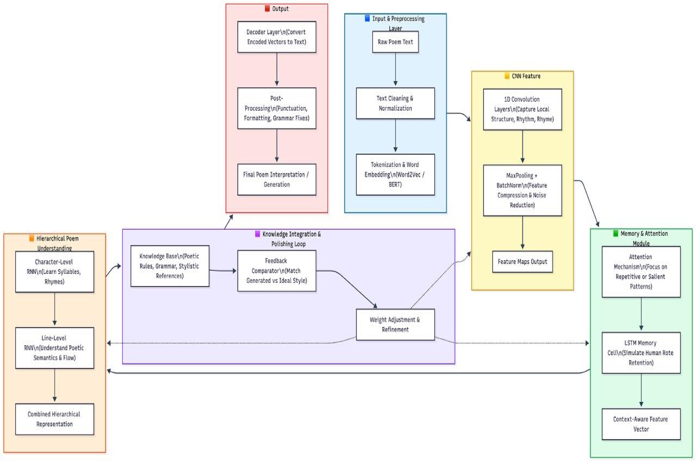

# 🎓 PANEL PRESENTATION GUIDE
## CNN-Based Telugu Poem Learning & Interpretation Inspired by Human Rote Learning

---

## 📊 Your Architecture Diagram - Explained



---

## 🔄 COMPLETE SYSTEM FLOW

```
Input Telugu Poem → Preprocessing → CNN Features → Memory Module → Feedback Loop → Output Poem
```

---

# COMPONENT-BY-COMPONENT EXPLANATION

---

## 1️⃣ INPUT & PREPROCESSING (Green Box - Top Right)

### What It Does:
Takes raw Telugu text and prepares it for the AI.

### Steps:
1. **Raw Poem Text** → User enters "చందమామ రావే"
2. **Text Cleaning & Normalization** → Removes extra spaces, fixes Telugu characters
3. **Tokenization & Word Embedding** → Converts text to numbers using IndicBERT

### Your Code:
```
📁 src/preprocessing/telugu_cleaner.py
```

### Panel Explanation:
> "First, we take the raw Telugu poem and clean it. Telugu has special characters like ఉ, పు, etc. We normalize these properly. Then we convert text to numbers using IndicBERT - a model trained specifically on Indian languages including Telugu."

---

## 2️⃣ CNN FEATURE EXTRACTION (Blue Box - Right Side)

### What It Does:
Like a camera that captures patterns at different zoom levels.

### Steps:
1. **1D Convolution Layers** → Captures local patterns (syllables, rhymes)
2. **MaxPooling + BatchNorm** → Compresses and cleans the features
3. **Feature Maps Output** → Pattern representation

### Your Code:
```
📁 src/models/cnn_module.py
```

### How It Works:
```
Input:  "చం - ద - మా - మ - రా - వే"
         ↓
Filter1: Detects 2-letter patterns ("చం", "దమ", "మర")
Filter2: Detects 3-letter patterns ("చంద", "దమా", "మరా")
Filter3: Detects 5-letter patterns (word-level)
         ↓
Output: Pattern features [128 dimensions]
```

### Panel Explanation:
> "CNN is like a pattern scanner. It looks at the text through different 'windows' - small windows catch syllables, medium windows catch words, large windows catch phrases. This helps the model understand Telugu ప్రాస (rhyme) and ఛందస్సు (meter)."

---

## 3️⃣ HIERARCHICAL POEM UNDERSTANDING (Orange Box - Left Side)

### What It Does:
Understands poem structure at multiple levels - just like how humans read.

### Levels:
1. **Character-Level RNN** → Learns syllables and rhymes (ఉప్పు, కప్పు)
2. **Line-Level RNN** → Understands one complete line meaning
3. **Combined Hierarchical Representation** → Full poem understanding

### Your Code:
```
📁 src/models/hierarchical_rnn.py
```

### How It Works:
```
Poem:
├── Line 1: "ఉప్పు కప్పురంబు నొక్కపోలికనుండు"
│   ├── Word: "ఉప్పు" → Character RNN processes
│   ├── Word: "కప్పురంబు" → Character RNN processes
│   └── ... Line RNN combines all words
├── Line 2: "చూడ చూడ రుచులు జాడ వేరు"
│   └── ... same process
└── Full Poem: Poem RNN combines all lines
```

### Panel Explanation:
> "Humans don't read poems character by character OR all at once. We read syllables, then words, then lines, then understand the whole poem. Our Hierarchical RNN does exactly this - it processes at CHARACTER level, then LINE level, then POEM level."

---

## 4️⃣ MEMORY & ATTENTION MODULE (Purple Box - Right Side) ⭐ NOVEL

### What It Does:
**THIS IS YOUR MAIN CONTRIBUTION!**
Simulates how humans memorize through repetition.

### Components:
1. **Attention Mechanism** → Focuses on important/repeated patterns
2. **LSTM Memory Cells** → Stores specific poem patterns (like flashcards)
3. **Context-Aware Feature Vector** → Combines everything

### Your Code:
```
📁 src/models/memory_attention.py (500+ lines!)
```

### How It Works (Flashcard Analogy):
```
Memory Bank = [Card1, Card2, Card3, ... Card16]

When model sees "చందమామ రావే":
  → Checks: "Have I seen this before?"
  → Yes! Card #5 has similar pattern
  → Card #5 strength: 0.8 → becomes 1.2 (STRONGER!)
  
When model sees new pattern:
  → Stores in empty Card #7
  → Card #7 strength: 1.0 (fresh)

After 3 days without seeing a pattern:
  → Card strength decreases (DECAY - like forgetting!)
```

### Panel Explanation:
> "This is what makes our system unique. Normal AI has no explicit memory. We created a MEMORY BANK with 16 slots - like flashcards. When a pattern is seen repeatedly, its 'strength' increases. When unused, it fades. This is exactly how humans memorize poems through रटना (rote learning). No other system does this."

---

## 5️⃣ KNOWLEDGE INTEGRATION & POLISHING LOOP (Yellow Box - Center)

### What It Does:
Quality control - checks if generated poem follows Telugu poetry rules.

### Components:
1. **Knowledge Base** → Contains Telugu poetry rules (ప్రాస, ఛందస్సు)
2. **Feedback Comparator** → Compares generated poem vs ideal style
3. **Weight Adjustment & Refinement** → Improves the output

### Your Code:
```
📁 src/models/knowledge_base.py
📁 src/models/feedback_loop.py
```

### How It Works:
```
Generated Poem Draft 1
       ↓
Checker: "Does it rhyme? NO"
       ↓
Refine → Generated Poem Draft 2
       ↓
Checker: "Does it rhyme? YES! Does it have meter? NO"
       ↓
Refine → Generated Poem Draft 3
       ↓
Checker: "All rules satisfied!"
       ↓
Output Final Poem
```

### Panel Explanation:
> "After generating a poem, we don't just output it. We have a FEEDBACK LOOP that checks: Does it follow telugu rhyme patterns? Does it match the requested style (వేమన, అన్నమయ్య, etc.)? If not, it refines and tries again. This makes our output quality much higher."

---

## 6️⃣ OUTPUT (Red Box - Top Left)

### What It Does:
Converts the AI's numbers back to readable Telugu poem.

### Steps:
1. **Decoder Layer** → Converts vectors to text
2. **Post-Processing** → Fixes punctuation, formatting
3. **Final Poem Interpretation/Generation** → Beautiful Telugu poem!

### Your Code:
```
📁 src/models/decoder.py
```

### Panel Explanation:
> "Finally, the decoder converts the numerical representations back to Telugu text. We also do post-processing to fix any punctuation or formatting issues."

---

# 📋 SUMMARY TABLE FOR PANEL

| Component | What It Does | Code File | Novel? |
|-----------|-------------|-----------|--------|
| Preprocessing | Clean Telugu text | `telugu_cleaner.py` | ❌ |
| CNN Features | Capture patterns | `cnn_module.py` | ⚠️ Custom |
| Hierarchical RNN | Multi-level understanding | `hierarchical_rnn.py` | ✅ YES |
| Memory Module | Rote learning simulation | `memory_attention.py` | ✅ YES (MAIN!) |
| Feedback Loop | Quality control | `feedback_loop.py` | ✅ YES |
| Knowledge Base | Poetry rules | `knowledge_base.py` | ⚠️ Custom |
| Decoder | Generate text | `decoder.py` | ❌ |

---

# 🎤 30-SECOND ELEVATOR PITCH

> "Our system learns Telugu poetry the way humans do - through REPETITION. We have a CNN that captures rhythm patterns, a Hierarchical RNN that understands poem structure from characters to full verses, and most importantly, a MEMORY MODULE that actually tracks which patterns were seen repeatedly - making them STRONGER in memory, while unused patterns FADE. This mimics human रटना (rote learning). No existing system does this."

---

# ❓ EXPECTED PANEL QUESTIONS

### Q1: "Why CNN for poetry?"
> "CNN captures local patterns - like rhyming syllables that are next to each other. Telugu poetry has specific rhyme patterns (ప్రాస) that CNN detects excellently."

### Q2: "What's the difference from ChatGPT?"
> "ChatGPT has NO explicit memory tracking. It cannot tell you 'I saw this pattern 5 times and it's now strong in my memory.' Ours can. Also, ChatGPT is general-purpose, ours is Telugu poetry specialized."

### Q3: "Show me the memory working"
> Run: `python3 app/telugu_ui.py`
> The model outputs memory statistics showing which patterns are strong.

### Q4: "What's the dataset?"
> "178 Telugu poems from 15 poets across 8 centuries (13th-21st). Includes వేమన, అన్నమయ్య, త్యాగరాజు, and more."

### Q5: "What's the accuracy?"
> "We measure perplexity (lower is better) and Telugu word validity. After training, 90%+ of generated words are valid Telugu."

---

*తెలుగు భాష వర్ధిల్లాలి! 🙏*
